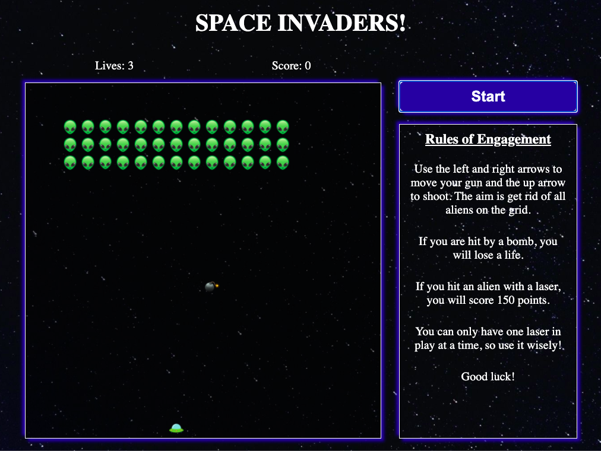
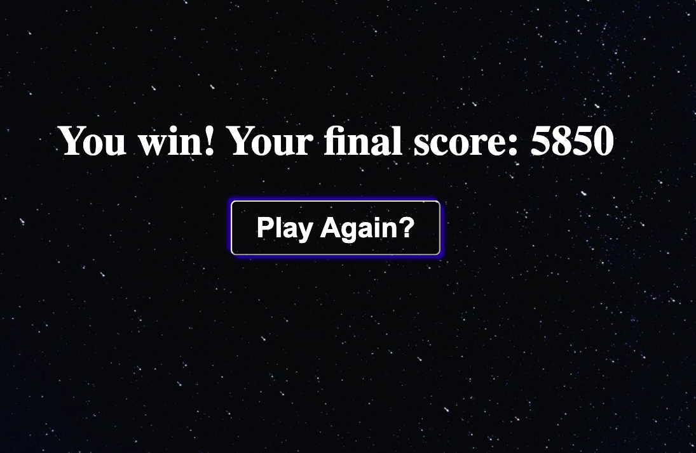

###  General Assembly, Software Engineering Immersive

# Space Invaders - Project One

## Overview

For the first project on the Software Engineering Immersive at General Assembly, I was tasked with building an arcade game within seven days. We were to apply the knowldege amassed over our first three weeks in order to do this.

The game was deloyed via GitHub Pages and is currently available to played on desktop with a keyboard.

[Play the game here!](https://hannahakhtar.github.io/project-1/)



## Project Brief

- Render a game in the browser
- The player should be able to clear at least one wave of the aliens
- The player's score should be displayed at the end of the game
- Use KISS (Keep It Simple Stupid) and DRY (Don't Repeat Yourself) principles
- Adhere to best practices and use semantic markup for HTML and
- Use JavaScript for DOM manipulation

## Space Invaders Brief 

- The player aims to shoot and kill all the aliens before they reach the planet's surface.
- If the player hits an alien with the rocket, the alien will disappear and the player will get 150   points. 
- The player can move left and right only along the bottom row.
- The aliens move left and right and will move down each time the reach the side of the screen.
- Aliens will drop bombs periodically and if they hit the player, they will lose a life.
- The aim is to achieve the highest score possible before the alien's bombs kill you or if they reach the planet (bottom of the grid).

## Technogies Used

- HTML5
- CSS3
- JavaScript (ES6)
- Git, GitHub & GitHub Pages

## The Approach

### The Grid

The grid for the game was built using JavaScript and DOM manipulation. Using a for loop, HTML divs were created and appended as children to the parent div, which had a class of grid. An array was also created, called cells, which would be used throughout the game creation.

 ``` js
 for (let index = 0; index < width * width; index++) {
  const cell = document.createElement('div')
  cell.classList.add('cell')
  grid.appendChild(cell)
  cells.push(cell)
  cell.style.width = `${100 / width}%`
}
```

### Alien Movement

The initial of the aliens were determined by creating an array and hard coding the index of the start position it related to within the cells array.

Direction was set using a global variable (let direction = 1) and the function alienMovement determined whether the aliens were to move left or right; if the aliens were at the left of the grid, they were to move right, and vice versa. If the aliens had reached the edge of the grid, they moved down a column, which was determined by direction equalling the value of the width (20).

```js
function alienMovement() {
  removeAlienClass()
  if (direction === 1 && displayAliens[0] % width === 7) {
    direction = width
  } else if (direction === -1 & displayAliens[0] % width === 0) {
    direction = width
  } else if (direction === width && displayAliens[0] % width === 7) {
    direction = -1
  } else if (direction === width && displayAliens[0] % width === 0) {
    direction = 1
  }
  updateAlienClass()
}

function removeAlienClass() {
  displayAliens.forEach((alien) => {
    cells[alien].classList.remove('alien')
  })
}

function updateAlienClass() {
  displayAliens = displayAliens.map(alien => alien + direction)
  displayAliens.forEach((alien) => {
    cells[alien].classList.add('alien')
  })
}
```

The aliensMove function udpated the position of the aliens every second, so that they would move across the board. This function was invoked within the startButton event listener, so the aliens would begin to move across the grid as the player pressed start.

```js
function aliensMove() {
  if (aliensMoving === false) {
    setInterval(alienMovement, 1000)
  }
}
```

### Bomb release and movement

To create the illusion of the aliens dropping a bomb, I firstly created the function randomBomb to determine where the bomb would be dropped from. Using the Math.random and Math.floor methods were used on the displayAlien array to calculate the initial position of the bomb and then the classList was added to the index below that of the initial position. Variables were then updated accordingly, which would impact when other functions were invoked.

```js
function randomBomb() {
  const alienBomber = Math.floor(Math.random() * displayAliens.length)
  bombStartPosition = displayAliens[alienBomber] + 20
  cells[bombStartPosition].classList.add('bomb')
  bombMoving = true
  bombInitiated = true
  bombBottom = false
}
```

The interval within the below function indicates that the randomBomb function was invoked every 2.5 seconds. In hindsight, this interval did not have to be nested within a function.

```js
function bombAlignedToAlien() {
  setInterval(() => {
    if (bombInitiated === false) {
      randomBomb()
    }
  }, 2500)
}
```
In order for the bomb to move down the grid, the classList was removed from the bombStartPosition, reassigned and then added to the bombStartPosition below. The interval bombOnMove determined that moveBomb function would be evaluated every 100 milliseconds.

```js
function moveBomb() {
  if (cells[bombStartPosition]) {
    cells[bombStartPosition].classList.remove('bomb')
    bombStartPosition += 20
    cells[bombStartPosition].classList.add('bomb')
  }
}

  bombOnMove = setInterval(() => {
    if (bombMoving === true) {
      moveBomb()
    }
  }, 100)
```

### Player movement and shooting the rocket

Within the startButton event listener, there was a further event listener which would track the when the player clicked the up, left and right buttons.

The player uses the left and right arrows to move across the grid with boundaries set at the end of the grid, so that the spaceship is not able to move through the walls.

The up arrow is used to shoot the rocket towards the aliens and the movement of the rocket is achieved with the rocketShot set inteval nested within the if statement.

I initially encoutered a bug if the rocket reached the top of the grid, as I was unable to then reset the position of the laser to be shot again. This was fixed by using an if else statement to reset the rocket position (based on the initial rocketPosition) if the newRocketPos was in the top column of the grid.

The rocket was 'hidden' behind the player at all times, which was achieved by using CSS specificity.

``` js
  document.addEventListener('keydown', (event) => {
    const key = event.key

    if (key === 'ArrowLeft' && !(playerStart % width === 0)) {
      cells[playerStart].classList.remove('spaceship')
      cells[rocketPosition].classList.remove('rocket')
      playerStart -= 1
      rocketPosition -= 1
      cells[playerStart].classList.add('spaceship')
      cells[rocketPosition].classList.add('rocket')
    } else if (key === 'ArrowRight' && !(playerStart % width === width - 1)) {
      cells[playerStart].classList.remove('spaceship')
      cells[rocketPosition].classList.remove('rocket')
      playerStart += 1
      rocketPosition += 1
      cells[playerStart].classList.add('spaceship')
      cells[rocketPosition].classList.add('rocket')
    } else if (key === 'ArrowUp') {
      audioPlayerShoots.play()
      if (hasRocket === false) {
        hasRocket = true
        newRocketPos = rocketPosition - 20
        if (newRocketPos > 19) {
          rocketShot = setInterval(() => {
            cells[newRocketPos].classList.remove('rocket')
            newRocketPos -= 20
            cells[newRocketPos].classList.add('rocket')
          }, 80)
        } else if (newRocketPos <= 19) {
          clearInterval(rocketShot)
          hasRocket = false
        }
      }
    }
  })
```

### Collision checks

Within the function checkCollision, there was a set interval running every millisecond, checking various 'collisions' i.e. when a grid index contained two classes that would affect the outcome of the game.

If the global variable, gameOver, was set to true, the interval would be cleared. The variable was set to true on if the player had lost all their lives or if the aliens reached the bottom of the grid.

```js
  const collisionCheck = setInterval(() => {
    if (gameOver === true) {
      clearInterval(collisionCheck)
```      

#### Restricting player to having one rocket on the grid at a time

Should the gameOver variable be false, the interval would continue to run.

I decided to only let the player have one laser on the grid at any one time. One challenge I faced was clearing the interval rocketShot, should the rocket miss the bombs and aliens, and reach the top of the grid. The below else if statement follows from the above, and this determined that if any of the cells in the top column has a classList of rocket, that the interval would be cleared and the various variables reset so the player could fire a new rocket.

```js
else if (cells[newRocketPos]) {
      for (let i = 0; i < width - 1; i++) {
        if (cells[i].classList.contains('rocket')) {
          hasRocket = false
          clearInterval(rocketShot)
          cells[newRocketPos].classList.remove('rocket')
          newRocketPos = null
        }
      }
```    

#### Player and bomb collision

The if statements below were nested in the above else if statement. I had to check for two varients; firstly if the player position and the bomb were in the same cell, but also if the laser was on the bottom row. Before this was taken into consideration, the lives were not reducing when the class for laser, the player and the bomb were all aligned to the same cell.

Additionally, if statements were nested in both conditions to check the number of lives remaining, and actioned accordingly.

```js
      if (cells[playerStart].classList.contains('bomb') && bottomRow.some(cell => cells[cell].classList.contains('rocket'))) {

        if (livesUpdate === 1) {
          livesUpdate -= 1
          displayLives.innerHTML = livesUpdate
          gameOver = true
          bombMoving = false
          bombInitiated = true
        } else if (livesUpdate >= 2) {
          livesUpdate -= 1
          displayLives.innerHTML = livesUpdate
          cells[playerStart].classList.remove('bomb')
          bombMoving = true
          bombInitiated = false
        }
      }

      if (cells[playerStart].classList.contains('bomb')) {
        audioBombHits.play()
        if (livesUpdate === 1) {
          livesUpdate -= 1
          displayLives.innerHTML = livesUpdate
          gameOver = true
          bombMoving = false
          bombInitiated = true
          gameEnded()
          modalText.innerHTML = `You lost! Your final score: ${scoreUpdate}`
        } else if (livesUpdate >= 2) {
          livesUpdate -= 1
          displayLives.innerHTML = livesUpdate
          cells[playerStart].classList.remove('bomb')
          bombMoving = true
          bombInitiated = false
        }
      }
```

#### Rocket and bomb collision

On the occasion that a rocket and bomb collided, the below if statement (within the collisionCheck function) was triggered. This reset various global variables to their initial state, so that new bombs would be created and dropped and the player could then also fire another rocket.

```js
if (cells[newRocketPos].classList.contains('bomb')) {
        hasRocket = false
        clearInterval(rocketShot)
        cells[newRocketPos].classList.remove('bomb')
        cells[newRocketPos].classList.remove('rocket')
        bombMoving = false
        bombInitiated = false
      }
```

#### Alien and rocket collision

If the player shot the rocket and it hit an alien, the below if statement updated the score, reset variables and used indexOf and splice to remove the alien hit from the displayAlien array.

```js
      if (cells[newRocketPos].classList.contains('alien')) {
        audioAlienHit.play()
        scoreUpdate += 150
        displayPoints.innerHTML = scoreUpdate
        hasRocket = false
        clearInterval(rocketShot)
        const collision = displayAliens.indexOf(newRocketPos)
        displayAliens.splice(collision, 1)
        cells[newRocketPos].classList.remove('rocket')
        cells[newRocketPos].classList.remove('alien')
        newRocketPos = null
      }
```

#### Bomb reaching bottom of grid

Initially, the bomb class was not being removed when this reached the bottom of the grid. To fix this bug, the below setTimeout was created to remove the class, should it reach the bottom. The same logic was included to update lives or end the game, if required.

```js
else if (bombStartPosition > 380 && !bombBottom) {
      bombMoving = false
      bombInitiated = false
      bombBottom = true
      setTimeout(() => {
        bottomRow.forEach(cell => cells[cell].classList.remove('bomb'))
      }, 100)

      if (cells[playerStart].classList.contains('bomb')) {
        audioBombHits.play()

        if (livesUpdate === 1) {
          livesUpdate -= 1
          displayLives.innerHTML = livesUpdate
          gameOver = true
          bombMoving = false
          bombInitiated = true
          gameEnded()
          modalText.innerHTML = `You lost! Your final score: ${scoreUpdate}`

        } else if (livesUpdate >= 2) {
          livesUpdate -= 1
          displayLives.innerHTML = livesUpdate
          cells[playerStart].classList.remove('bomb')
          bombMoving = true
          bombInitiated = false
        }
      }
    }
```

#### Final score, win/lost and restart game

Once the collision checks were completed and either the player won or lost, the final score and outcome would be displayed by manipulating the modalText inner HTML.

```js
modalText.innerHTML = `You lost! Your final score: ${scoreUpdate}`
```

```js
modalText.innerHTML = `You win! Your final score: ${scoreUpdate}`
```

Within the collision checks, the gameEnded function was initited which paused music and also initiated the modal which displayed the outcome and final score.

```js
function gameEnded() {
  gameEndedModal()
  audioPlayer.pause()
  audioPlayerDead.play()
}

function gameEndedModal() {
  modal.classList.add('show_modal')
}

modalButton.addEventListener('click', () => {
  location.reload()
})
```
There was also a button which allowed the player to play again. Location reload was used to do this, however, in hindsight, I would have used a function to reset the elements needed to restart the game.



## Victories

- This was my first project and I am extremely proud to have a working game and more confidence in my coding abiltiies.
- Whilst the initial stages of the project were tough, I was able to debug a number of bugs on my own, which is a new skill for me.

## Challenges and lessons learned 

- I spent the first day planning and writing my pseudocode but I found that during the project, I had to add additional functions that I did not plan for, which added to the complexity and repetition of code. This has highlighted the importance of planning and reviewing edge cases before starting coding.
- As this was my first project, I have gained knowledge in using multiple setIntervals. It was a challenge to ensure that all intervals were 'caught', which is why the collision check was set to 1ms, ensuring ensure that I would be able to check for collisions constantly.
- The value in using console.log; using this was extremely useful to understand what was being called at certain points with the code, which helped with debugging.

## Future feature ideas

- Mobile responsive
- Utilise local storage for persistent high scores
- Allow players to shoot the rocket more often
- Levels to make the game harder each time the player clears a wave; aliens move faster etc.
- Refactor code - having only just finished the game, I am already aware of the benefits of refactoring my code to make it DRY. Having run into bugs due to how my code was written and the use of my event listeners, I plan to redo this game at the end of the course to see the progression I have made.

## Image and sound credit

- All sound effects from: https://www.classicgaming.cc/classics/space-invaders/sounds
- Background image from: https://unsplash.com/@laup
- Icons from: https://www.canva.com/en_gb/